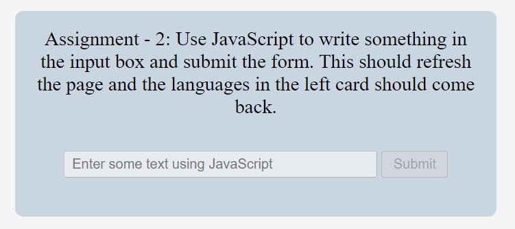

## Task 1 - Removing the languages that have 2.0 in their name (Every alternative language)

### Before solving


```Javascript
let anchor = document.querySelectorAll("a"); // selecting the anchor tage
      let arr = [...anchor] // converting it to array
      for (let i = 0; i<=arr.length; i++){
        if(i%2 == 1){
          arr[i].remove();
        }
      } // removing the undesired values according to question
```
### After solving


## Task 2 - Use Javascript to write something in the input box and submit the form. This should refresh the page and the languages in the left card sholud coe back.

### Before solving


```Javascript
// Writing something in the input box

let inputTag = document.querySelector(".main__form-input");
inputTag.disabled = false;
inputTag.value = "iNeuron";

// Submitting the form
      
let newButton = document.querySelector(".main__form-btn");
newButton.disabled = false;
newButton.submit();

```
### After solving


